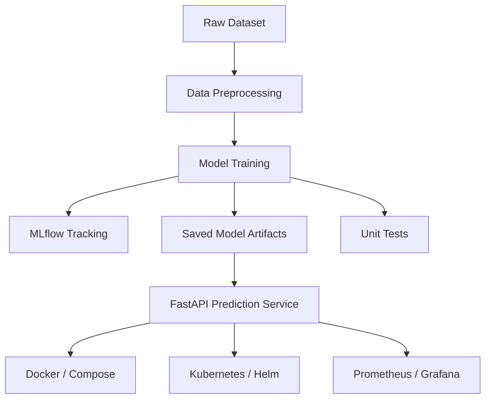

# Execution Guide: Heart Disease Prediction MLOps Assignment

This guide walks through the assignment from setup to final submission.

## 1. Prerequisites
- Install Python 3.11+
- Install Git and VS Code
- Ensure you are in the project root folder

## 2. Create and activate the environment
Open PowerShell in the project folder and run:

```powershell
python -m venv .venv
.\.venv\Scripts\Activate.ps1
python -m pip install --upgrade pip
pip install -r requirements.txt
```

## 3. Explore the dataset and understand the problem
- Review the raw data file at [data/raw/heart_cleveland.csv](data/raw/heart_cleveland.csv)
- Open the notebooks in [notebooks](notebooks) for EDA and preprocessing understanding
- Inspect the preprocessing logic in [src/data/preprocessing.py](src/data/preprocessing.py)

## 4. Run preprocessing and prepare the data
Run:

```powershell
python -m src.data.preprocessing
```

This step loads the data, handles missing values, encodes features, and prepares training data.

## 5. Train the machine learning models
Run:

```powershell
python -m src.models.train
```

This trains multiple classifiers, evaluates them, and saves the best model plus preprocessor to [models](models).

## 6. Track experiments with MLflow
Start the MLflow UI:

```powershell
python -m mlflow ui --host 127.0.0.1 --port 5000
```

Then open:

```text
http://127.0.0.1:5000
```

You can compare training runs and inspect metrics/artifacts stored in [mlruns](mlruns).

## 7. Run the automated tests
Run:

```powershell
pytest -q
```

This verifies preprocessing, training, and API behavior.

## 8. Start the prediction API locally
Run:

```powershell
python -m uvicorn src.api.main:app --host 127.0.0.1 --port 8000
```

Then open:

```text
http://127.0.0.1:8000/docs
```

You can test the prediction endpoint from the Swagger UI.

## 9. Containerize the application
Build the Docker image:

```powershell
docker build -t heart-disease-api .
```

Run the container:

```powershell
docker run -p 8000:8000 heart-disease-api
```

## 10. Run with Docker Compose
Use:

```powershell
docker-compose up --build
```

This starts the services defined in [docker-compose.yml](docker-compose.yml).

## 11. Deploy with Kubernetes or Helm
Deployment assets are available in [deployment/kubernetes](deployment/kubernetes) and [deployment/helm/heart-disease-api](deployment/helm/heart-disease-api).

Example:

```powershell
kubectl apply -f deployment/kubernetes/
```

## 12. Monitor the application
Monitoring configuration is available in [monitoring/prometheus](monitoring/prometheus) and [monitoring/grafana](monitoring/grafana).

- Prometheus scrapes the metrics endpoint
- Grafana visualizes the service metrics

## 13. Final submission checklist
- Confirm model artifacts exist in [models](models)
- Confirm tests pass with pytest
- Confirm API runs locally
- Confirm documentation is updated in [README.md](README.md) and [FINAL_REPORT.md](FINAL_REPORT.md)
- Prepare screenshots and the final report for submission

## Architecture Diagram


