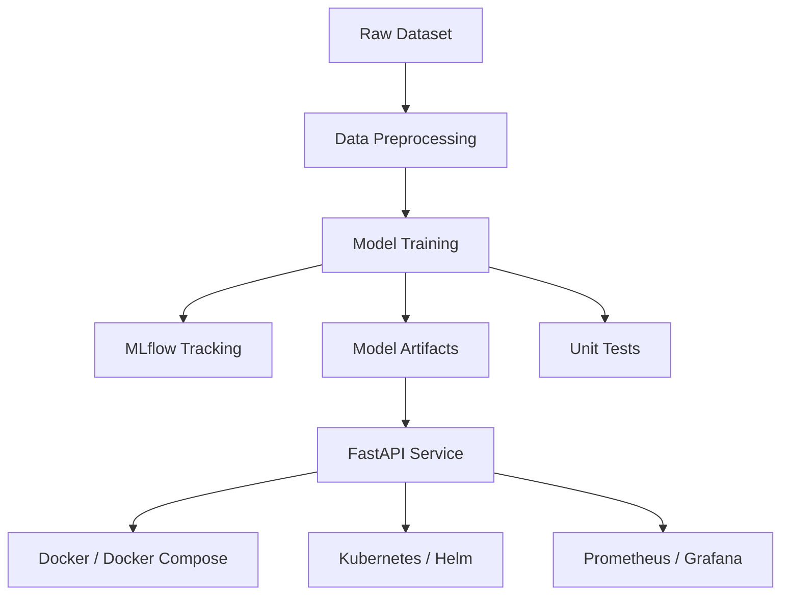

# Professional Report: Heart Disease Prediction MLOps Assignment

## Submitted by
RAJ KUMAR M  
2024AD05110@WILP.BITS-PILANI.AC.IN

## 1. Project Overview
This assignment demonstrates an end-to-end MLOps workflow for predicting heart disease using the Cleveland heart disease dataset. The solution includes data preprocessing, model training, experiment tracking with MLflow, unit testing, API serving, containerization, deployment assets, monitoring, and documentation.

The repository is organized to reflect a realistic production-style ML pipeline and is suitable for academic submission as well as practical deployment demonstration.

---

## 2. Setup and Installation Instructions

### Prerequisites
- Python 3.11 or later
- Git
- Docker (optional for containerization)
- Kubernetes tools (optional for deployment)

### Environment Setup
```powershell
python -m venv .venv
.\.venv\Scripts\Activate.ps1
python -m pip install --upgrade pip
pip install -r requirements.txt
```

### Run the Project
```powershell
# Preprocess the data
python -m src.data.preprocessing

# Train the model
python -m src.models.train

# Start the API locally
python -m uvicorn src.api.main:app --host 127.0.0.1 --port 8000

# Launch MLflow UI
python -m mlflow ui --host 127.0.0.1 --port 5000
```

### Run Tests
```powershell
pytest -q
```

### Docker Workflow
```powershell
docker build -t heart-disease-api .
docker run -p 8000:8000 heart-disease-api
```

---

## 3. Exploratory Data Analysis and Modeling Choices

### Data Source
The raw dataset is available in [data/raw/heart_cleveland.csv](data/raw/heart_cleveland.csv).

### EDA Activities
The preprocessing and EDA workflow in [src/data/preprocessing.py](src/data/preprocessing.py) and [notebooks/01_data_acquisition_eda.ipynb](notebooks/01_data_acquisition_eda.ipynb) includes:
- Dataset inspection and schema review
- Missing value analysis
- Duplicate detection
- Feature distribution review
- Target class distribution review
- Correlation and relationship analysis

### Modeling Approach
The training pipeline in [src/models/train.py](src/models/train.py) evaluates multiple classifiers, including:
- Logistic Regression
- Random Forest
- Gradient Boosting
- Support Vector Machine

The best-performing model is saved for inference along with the fitted preprocessor in [models](models).

### Supporting Visual Evidence
- [screenshots/target_distribution.png](screenshots/target_distribution.png)
- [screenshots/missing_values.png](screenshots/missing_values.png)
- [screenshots/correlation_heatmap.png](screenshots/correlation_heatmap.png)
- [screenshots/categorical_distributions.png](screenshots/categorical_distributions.png)
- [screenshots/numeric_distributions.png](screenshots/numeric_distributions.png)
- [screenshots/target_correlation.png](screenshots/target_correlation.png)
- [screenshots/pairplot.png](screenshots/pairplot.png)

---

## 4. Experiment Tracking Summary
The training workflow integrates MLflow to log:
- Model parameters
- Evaluation metrics
- Artifacts and plots
- Experiment metadata

The experiment artifacts are stored in [mlruns](mlruns), enabling comparison between model runs and reproducibility of the training process.

---

## 5. Architecture Diagram



---

## 6. CI/CD and Deployment Workflow
The repository includes an automated CI/CD workflow in [.github/workflows/ci-cd.yml](.github/workflows/ci-cd.yml) that performs:
- Linting checks
- Unit test execution
- Model training
- Docker image build validation
- Security scanning
- Staging and production deployment steps

### Deployment Assets
- Kubernetes manifests: [deployment/kubernetes](deployment/kubernetes)
- Helm chart: [deployment/helm/heart-disease-api](deployment/helm/heart-disease-api)
- Container definition: [Dockerfile](Dockerfile)
- Container orchestration: [docker-compose.yml](docker-compose.yml)

### Workflow Screenshots
The following screenshots should be attached in the final submission to visually demonstrate the workflow:
1. GitHub Actions workflow run showing lint, test, train, and build jobs.
2. Docker image build or container execution output.
3. Kubernetes deployment status showing pods and service readiness.
4. Grafana or Prometheus monitoring dashboard.

Relevant supporting assets:
- [screenshots](screenshots)
- [.github/workflows/ci-cd.yml](.github/workflows/ci-cd.yml)
- [monitoring/prometheus/prometheus.yml](monitoring/prometheus/prometheus.yml)
- [monitoring/grafana](monitoring/grafana)

---

## 7. Verification Summary
The implementation was verified locally with the following command:

```powershell
pytest -q
```

Observed result:
- 60 tests passed
- 1 warning

---

## 8. Code Repository Link
GitHub repository: https://github.com/RAJKUMAR27M/MLOPS-Assignment

---

## 9. Conclusion
This project successfully delivers a complete MLOps assignment solution for heart disease prediction. It covers data preparation, model development, experiment tracking, testing, packaging, deployment readiness, monitoring, and documentation in a structured and professional manner.
