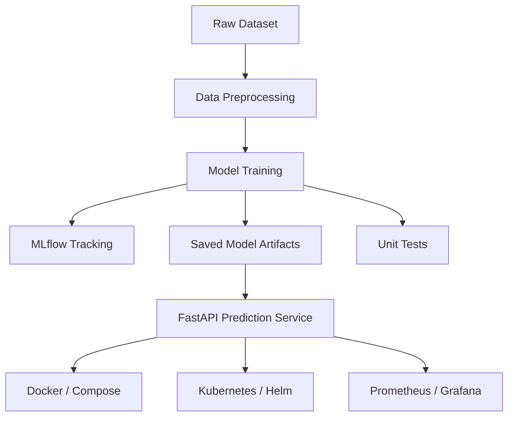

# Heart Disease Prediction MLOps Assignment

This repository contains a compact end-to-end MLOps solution for predicting heart disease risk from the UCI Cleveland heart disease dataset.

## What is included

- Data loading and preprocessing
- Model training with MLflow tracking
- A FastAPI prediction service
- Unit tests for preprocessing, training, and API behavior
- Docker and deployment assets for local serving

## Quick start

1. Create and activate a virtual environment.
2. Install dependencies:
   ```bash
   pip install -r requirements.txt
   ```
3. Train the model:
   ```bash
   python -m src.models.train
   ```
4. Start the API:
   ```bash
   python -m uvicorn src.api.main:app --host 127.0.0.1 --port 8000
   ```
5. Run the tests:
   ```bash
   pytest -q
   ```

## Full assignment execution guide

A step-by-step walkthrough from setup to final submission is available in [EXECUTION_GUIDE.md](EXECUTION_GUIDE.md).

## Architecture overview



## Main project folders

- data/: raw and processed datasets
- src/data/: preprocessing utilities
- src/models/: training and evaluation logic
- src/api/: FastAPI app and request schemas
- tests/: assignment-focused unit tests
- deployment/ and monitoring/: container and observability assets

## Notes

The implementation is intentionally kept focused on the assignment requirements: data preparation, model training, experiment tracking, API deployment, and testing.
