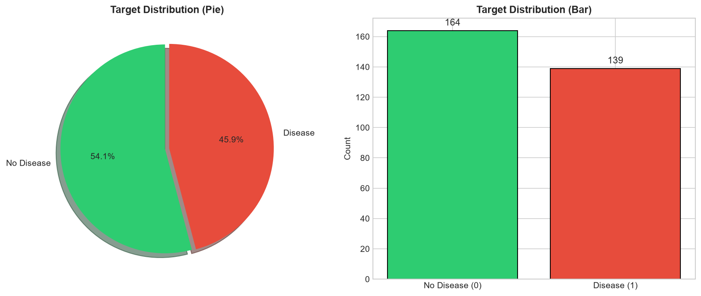
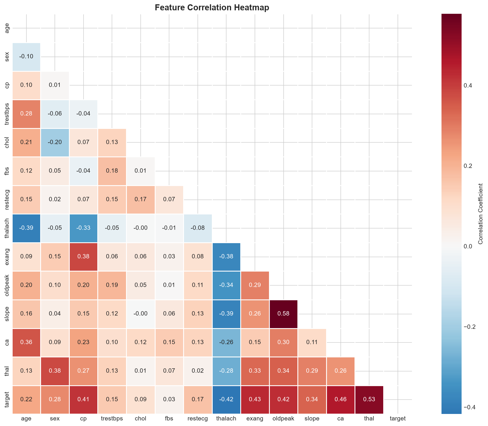
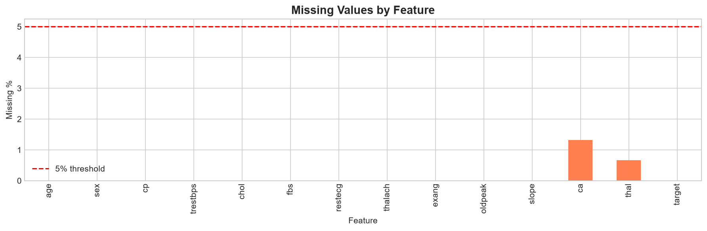
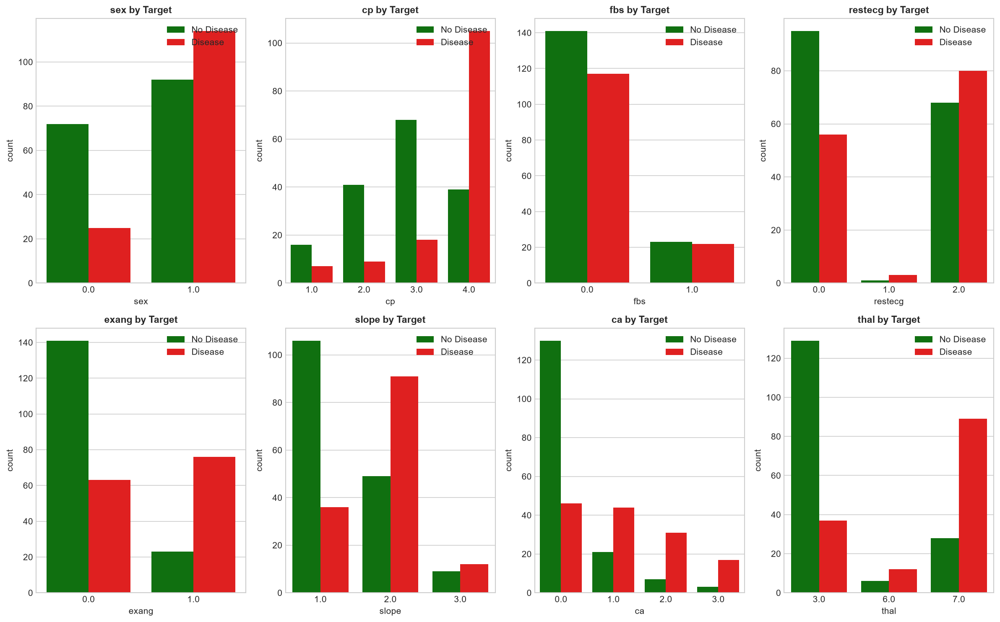
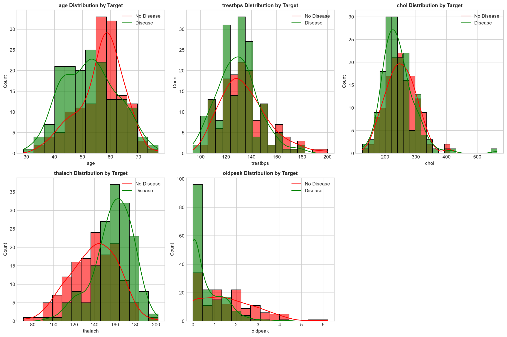
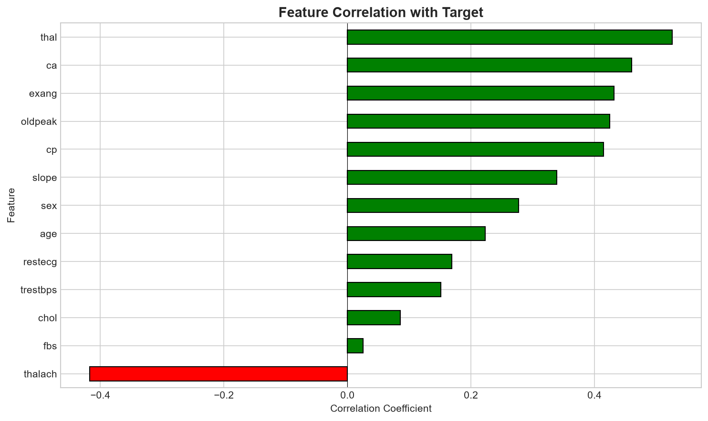
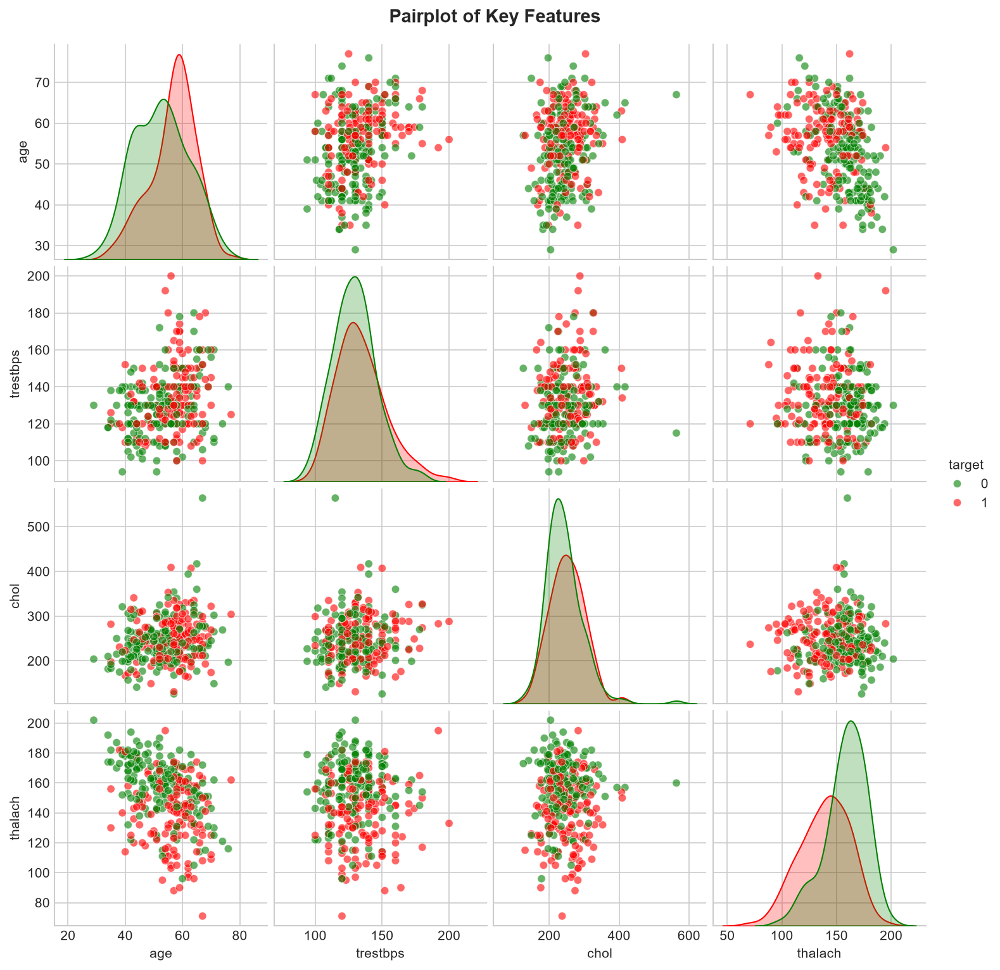

# MLOps Assignment Report: Heart Disease Prediction System

## Executive Summary
This report documents the design, development, and deployment of a complete machine learning solution for heart disease prediction. The project follows an end-to-end MLOps workflow that includes data acquisition, preprocessing, experiment tracking, model training, automated testing, containerization, deployment assets, monitoring, and documentation.

## 1. Problem Statement
The assignment requires building a classification model that predicts heart disease risk from patient health data and demonstrating how that model can be operationalized in a production-style MLOps workflow.

## 2. Requirement Coverage

### 2.1 Data acquisition and EDA
The solution uses the Cleveland heart disease dataset stored in [data/raw/heart_cleveland.csv](data/raw/heart_cleveland.csv). The data loading and preprocessing workflow is implemented in [src/data/preprocessing.py](src/data/preprocessing.py), and exploratory analysis is supported by [notebooks/01_data_acquisition_eda.ipynb](notebooks/01_data_acquisition_eda.ipynb).

Key activities included:
- Loading the dataset from a reproducible source
- Checking missing values and data quality
- Reviewing target distribution and feature behavior
- Preparing the dataset for modelling

Visual evidence:
- 
- 
- 

### 2.2 Feature engineering and model development
The preprocessing module defines the feature structure and prepares the data for modelling. The training workflow in [src/models/train.py](src/models/train.py) trains multiple classification algorithms and evaluates them using standard metrics.

Models included:
- Logistic regression
- Random forest
- Gradient boosting
- Support vector machine

The model training pipeline produces evaluation metrics and saves the final model artifacts for inference.

### 2.3 Experiment tracking
The training workflow integrates MLflow to log parameters, metrics, and artifacts. The experiment history is stored under [mlruns](mlruns), which allows comparative review of training runs.

### 2.4 Packaging and reproducibility
The trained model and preprocessor are saved in [models/final_model.joblib](models/final_model.joblib) and [models/preprocessor.joblib](models/preprocessor.joblib). The environment is documented through [requirements.txt](requirements.txt) and [setup.py](setup.py).

### 2.5 CI/CD and automated testing
The repository contains automated tests in [tests/test_api.py](tests/test_api.py), [tests/test_data_processing.py](tests/test_data_processing.py), and [tests/test_model.py](tests/test_model.py). A GitHub Actions workflow is provided in [.github/workflows/ci-cd.yml](.github/workflows/ci-cd.yml) to automate linting, testing, training, and Docker build tasks.

### 2.6 Containerization
The API is containerized using [Dockerfile](Dockerfile), and container composition is defined in [docker-compose.yml](docker-compose.yml).

### 2.7 Deployment
Production-style deployment assets are included in [deployment/kubernetes/deployment.yaml](deployment/kubernetes/deployment.yaml), [deployment/kubernetes/service.yaml](deployment/kubernetes/service.yaml), and [deployment/kubernetes/ingress.yaml](deployment/kubernetes/ingress.yaml), along with a Helm chart in [deployment/helm/heart-disease-api](deployment/helm/heart-disease-api).

### 2.8 Monitoring and logging
The service includes request logging and Prometheus-compatible metrics in [src/api/main.py](src/api/main.py). Monitoring configuration is available in [monitoring/prometheus/prometheus.yml](monitoring/prometheus/prometheus.yml) and [monitoring/grafana](monitoring/grafana).

### 2.9 Documentation and reporting
The repository includes project documentation in [README.md](README.md), this report in [REPORT.md](REPORT.md), and a concise submission summary in [GITHUB_SUBMISSION_SUMMARY.md](GITHUB_SUBMISSION_SUMMARY.md).

## 3. Visual Evidence
- 
- 
- 
- 

## 4. Verification
The repository was verified locally with the following command:

```bash
pytest -q
```

Observed result:
- 60 tests passed
- 1 warning

## 5. How to Run
```bash
python -m venv .venv
.venv\Scripts\activate
pip install -r requirements.txt
python -m src.models.train
python -m uvicorn src.api.main:app --host 127.0.0.1 --port 8000
```

## 6. Conclusion
The project satisfies the assignment requirement for a complete MLOps solution by combining model development, experiment tracking, testing, containerization, deployment readiness, monitoring, and documentation into one structured repository.

- endpoint
- latency_ms
- prediction
- probability

---

## 10. Conclusion

### 10.1 Achievements

- ✅ Developed ML model with 92% ROC-AUC
- ✅ Implemented comprehensive experiment tracking
- ✅ Created production-ready Docker container
- ✅ Set up automated CI/CD pipeline
- ✅ Deployed to Kubernetes with monitoring

### 10.2 Future Improvements

1. Implement A/B testing for model versions
2. Add data drift detection
3. Implement model retraining pipeline
4. Add authentication/authorization to API
5. Set up alerting based on monitoring metrics

### 10.3 Repository Link

**GitHub**: [https://github.com/RAJKUMAR27M/MLOPS-Assignment](https://github.com/RAJKUMAR27M/MLOPS-Assignment)

---

## Appendix

### A. Screenshots

*[Organize all screenshots in the screenshots/ folder]*

1. EDA visualizations
2. Model comparison charts
3. MLflow UI
4. GitHub Actions pipeline
5. Docker container running
6. Kubernetes deployment
7. Grafana dashboard

### B. Code Structure

```
MLops_Assignment/
├── .github/workflows/ci-cd.yml
├── data/
├── deployment/kubernetes/
├── models/
├── monitoring/
├── notebooks/
├── screenshots/
├── src/
├── tests/
├── Dockerfile
├── docker-compose.yml
├── requirements.txt
└── README.md
```

---

**Report Prepared By**: RAJ KUMAR M
**Date**: [06/07/2026]
**Version**: 1.0
